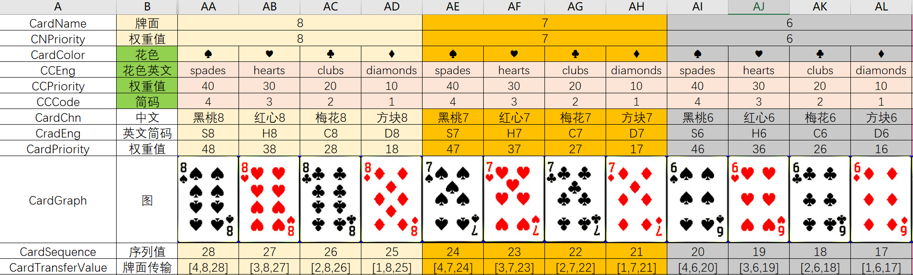
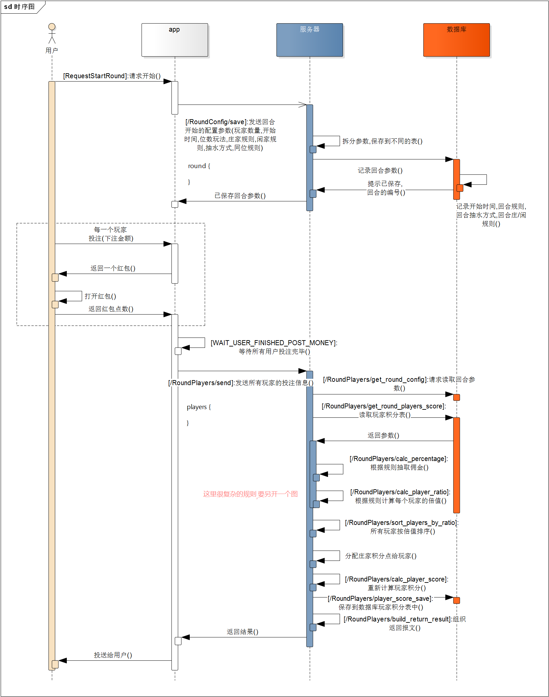

# CardGame 卡牌游戏十三水

## 项目概述 Project Overview

The business logic of a game program explains the calculation process of thirteen-water chess

《十三水》是从70年代末开始盛行于闽浙一代的牌类游戏，后经闽浙一带流传与全国各地，其发展史是由前苏联《十三张》改进变数而来的。在华东、华南地区通称为《十三水》，浙江某些地区仍称为《罗宋》，江苏某些地方称为《拼罗松》，港澳地区和海外地区称之为《十三张》。《十三水》、《罗宋》、《拼罗松》、《十三张》的规则、牌型、牌型大小是完全相符的。不同的是，此游戏在地域的划分中存在着不同的游戏名称，并且游戏的特殊牌型并没有统一的玩法标准。在地区之间存在着不同的特殊牌型与注数的变更。

Thirteen Waters" is a card game that started to flourish in the late 1970s in Fujian and Zhejiang, and later spread throughout the country through Fujian and Zhejiang, and its development history is based on the improved variation of the former Soviet Union's "Thirteen Waters". In East China and South China, it is commonly known as "Thirteen Waters", while in some areas of Zhejiang, it is still known as "Lorsong", in some parts of Jiangsu, it is called "Spelling Lorsong", and in Hong Kong, Macao and overseas, it is called "Thirteen Tables". The rules, card types and card sizes of "Thirteen Waters", "Rosong", "Spelling Rosong", and "Thirteen Tables" are exactly the same. The difference is that there are different game names for this game in the geographical division and there is no uniform standard of play for the special cards of the game. There are different variations of special tiles and bets between regions.

## 符号系统 Symbol System

牌类的编码是根据牌面的意义进行编码，一副牌共有52张，每种花色所代表含义都所不同，我们依次将这些牌按1-52的顺序进行了编排。

The cards are coded according to the meaning of the cards. There are 52 cards in a deck, each suit represents a different meaning, and we have arranged the cards in the order of 1-52.

通过这些符号，我们构建了一系列玩法和规则。

Through these symbols, we build a series of play styles and rules.

## 牌型 Card Type
     | =============================================================================================================
     | 名称    英文                         中文                      数值
     | =============================================================================================================
     | 五同    fiveSameCardValue            wutong
     | 同花顺  straightFlush                tonghuashun
     | 铁支    fourSameWithOneDiff          tiezhi
     | 葫芦    threeSameWithPair            hulu
     | 同花    fiveSameSuit                 tonghua
     | 顺子    straight                     shunzi
     | 三条    threeSameWithTwoDiff         santiao
     | 两对    twoPairWithOneDiff           liangdui
     | 对子    onePairWithThreeDiff         duizi
     | 乌龙    fiveDiff                     wulong
     | =============================================================================================================

## 规则 Rules

## 运行机制 Runtime Principle

### 全生命周期 Full Life Cycle

### 玩家准备原理 Player Preparation Principle

### 头道牌逻辑 First Round Card Logic

### APP交互 APP Interaction

### 同点策略 APP Interaction

